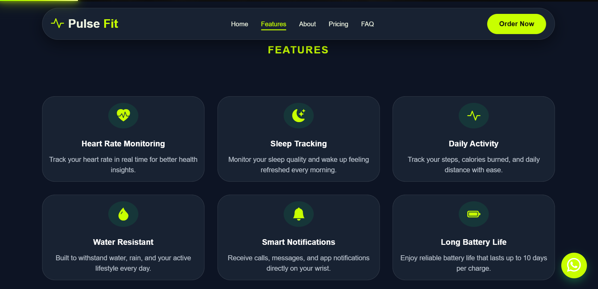
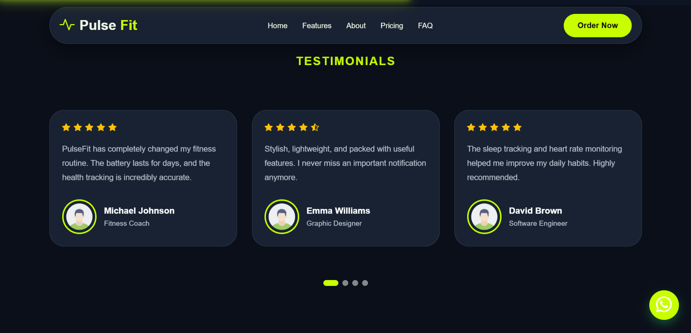
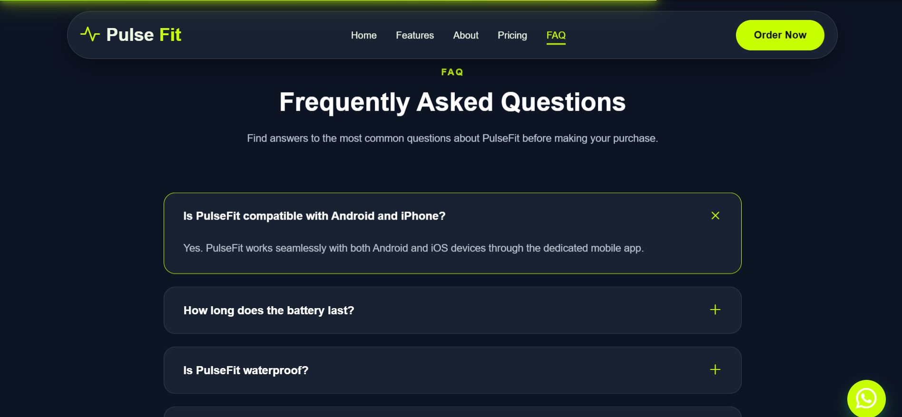
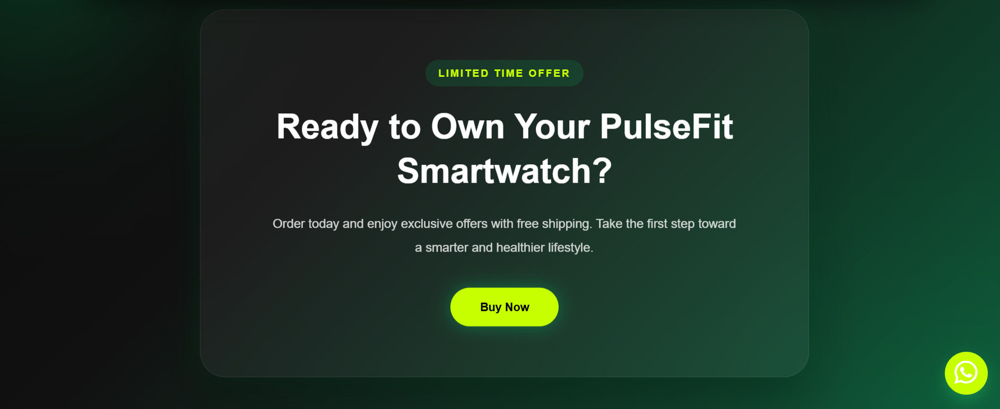
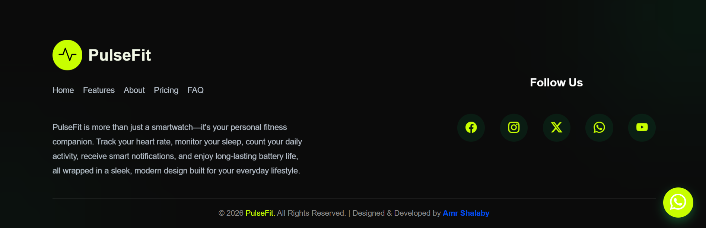

# 🌐 Landing Page

<div align="center">

A modern, responsive Landing Page built using HTML, CSS, and JavaScript.


</div>

---

## Overview

This project is a responsive and modern landing page designed to provide an engaging user experience. It features a clean layout, interactive elements, and a fully responsive design that adapts seamlessly across different screen sizes.

---

## Features

- Fully Responsive Design
- Modern and Clean UI
- Smooth Animations
- Interactive Elements
- Fast Loading
- Cross-Browser Compatibility

---

## Technologies Used

| Technology | Purpose                     |
| ---------- | --------------------------- |
| HTML5      | Page Structure              |
| CSS3       | Styling & Responsive Design |
| JavaScript | Interactivity               |

---

## Project Structure

```text
Landing-Page/
│
├── index.html
├── css/
│   └── style.css
├── js/
│   └── script.js
├── images/
└── README.md
```

---

## Getting Started

1. Clone the repository:

```bash
git clone https://github.com/AmrSHalaby202005/Pulse-Fit.git
```

2. Open the project folder.

3. Run `index.html` in your browser.

---

## Screenshots

### Hero


### Features



### About


### Pricing


### testimonials



### Faq



### Cta



### Footer



---

## Future Improvements

- Dark Mode
- More Animations
- Multi-language Support
- Contact Form Integration

---

## Author

**Amr Shalaby**

GitHub: https://github.com/AmrSHalaby202005

---

If you like this project, don't forget to give it a star!
